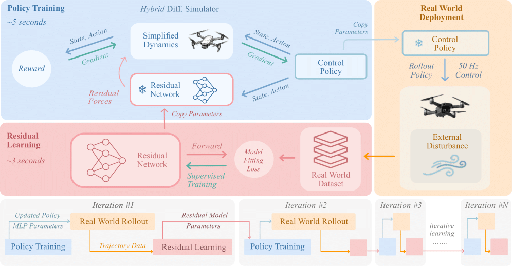
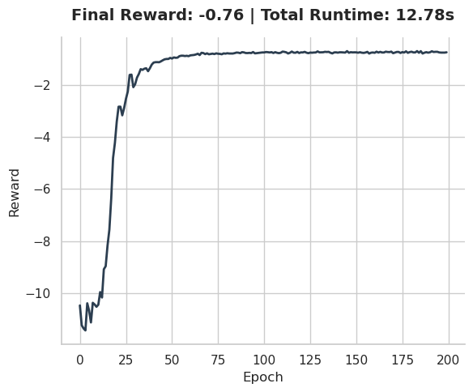
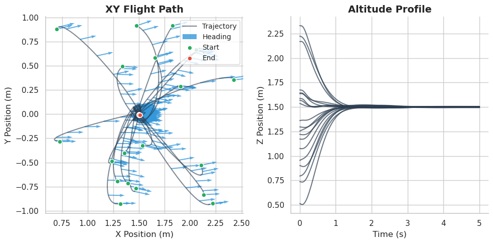
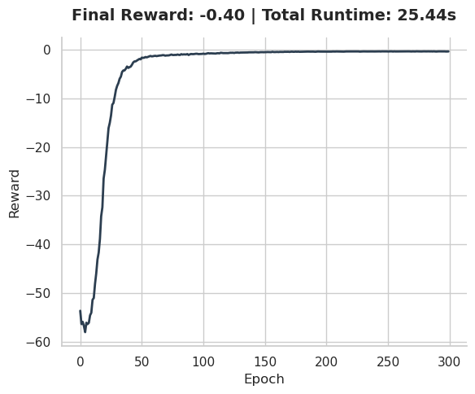
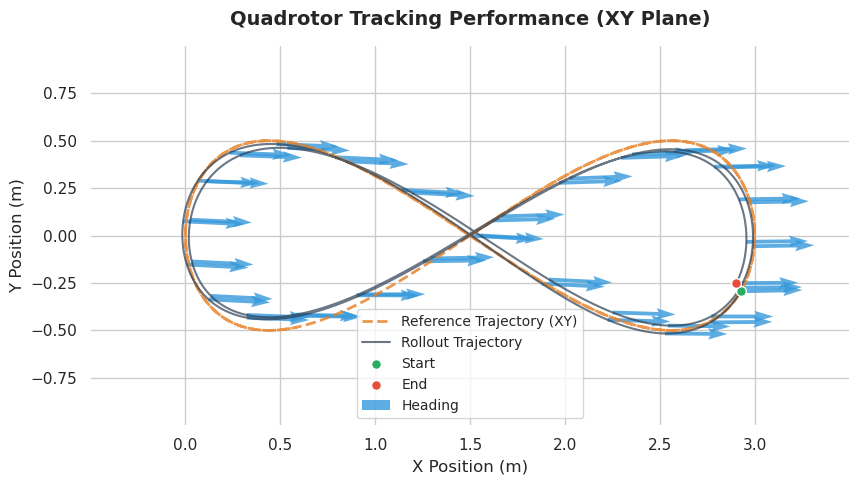
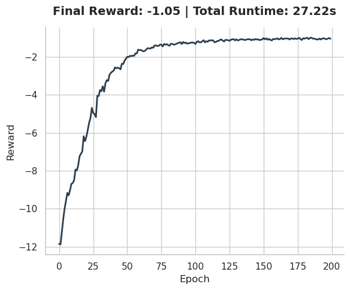
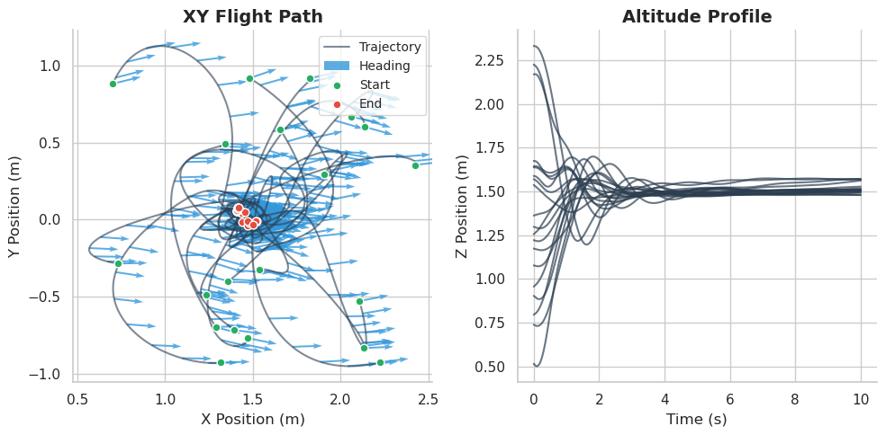

<p align="center">
  <h1 align="center"> 𝗟𝗲𝗮𝗿𝗻𝗶𝗻𝗴 𝗼𝗻 𝘁𝗵𝗲 𝗙𝗹𝘆: Rapid Policy Adaptation <br> via Differentiable Simulation </h1>
  <p align="center">
    <a href="https://mpan31415.github.io/">Jiahe Pan</a><sup>*</sup>
    .
    <a href="https://jiaxux.ing/">Jiaxu Xing</a><sup>*</sup>
    .
    <a href="https://rudolfreiter.github.io/">Rudolf Reiter</a>
    .
    <a href="https://www.linkedin.com/in/daniel-yifan-zhai/">Yifan Zhai</a>
    .
    <a href="https://eliealjalbout.github.io/">Elie Aljalbout</a>
    .
    <a href="https://rpg.ifi.uzh.ch/people_scaramuzza.html">Davide Scaramuzza</a>
  </p>
  <p align="center">
    <i>Robotics and Perception Group, University of Zürich</i>
  </p>
  <p align="center"> <strong>IEEE Robotics and Automation Letters (RA-L) </strong> - To appear at <a href="https://2026.ieee-icra.org/">ICRA 2026</a></p>
  <h3 align="center">

 <!-- [](-) -->
 [](https://arxiv.org/abs/2508.21065)
 [](https://opensource.org/license/gpl-3-0)
 <div align="center"></div>
</p>

<p align="center">
  <a href="">
    
  </a>
</p>

## 📃 Abstract
Learning control policies in simulation enables rapid, safe, and cost-effective development of advanced robotic capabilities. However, transferring these policies to the real world remains difficult due to the sim-to-real gap, where unmodeled dynamics and environmental disturbances can degrade policy performance. Existing approaches, such as domain randomization and Real2Sim2Real pipelines, can improve policy robustness, but either struggle under out-of-distribution conditions or require costly offline retraining. In this work, we approach these problems from a different perspective. Instead of relying on diverse training conditions before deployment, we focus on rapidly adapting the learned policy in the real world in an online fashion. To achieve this, we propose a novel online adaptive learning framework that unifies residual dynamics learning with real-time policy adaptation inside a differentiable simulation. Starting from a simple dynamics model, our framework continuously refines the model using real-world data to capture unmodeled effects and disturbances, such as payload changes and wind. The refined dynamics model is embedded in a differentiable simulation framework, enabling gradient backpropagation through the dynamics and thus rapid, sample-efficient policy updates beyond the reach of classical RL methods like PPO. All components of our system are designed for rapid adaptation, enabling the policy to adjust to unseen disturbances within **5 seconds** of training. We validate the approach on agile quadrotor control under various disturbances in both simulation and the real world. Our framework reduces hovering error by up to 81% compared to L1-MPC and 55% compared to DATT, while also demonstrating robustness in vision-based control without explicit state estimation.

<p align="center">
  <a href="">
    
  </a>
</p>

## :hammer_and_wrench: Installation
The code has been tested on: 
```yaml
Ubuntu: 20.04 / 22.04 / 24.04 LTS
Python: 3.9.18 (conda env provided)
CUDA: 12.9
GPU: RTX 4060 / RTX 4090
```

## 📦 Setup

Clone the repo and setup as follows:

```bash
$ git clone git@github.com:uzh-rpg/learning_on_the_fly.git
$ cd learning_on_the_fly
$ conda env create -f environment.yml
$ conda activate lotf
$ pip install --use-pep517 -e .
```
The configured conda environment also contains ROS-Noetic files, and therefore enables integrating our method with ROS stacks for hardware deployment. 


## 💾 Checkpoints
We provide **pretrained checkpoints** of policy networks and residual dynamics models. The directory is structured as follows:

```bash
learning_on_the_fly
└── checkpoints
    ├── policy
    │   ├── state_hovering_params
    │   └── traj_tracking_params
    │   └── vision_hovering_params
    │   └── vision_hovering_pre_params
    └── residual_dynamics
        ├── dummy_params
        └── example_params
```

## 📖 Quick-Start Guides
We provide detailed guides on running each of the components in our method, including **base policy training**, **residual dynamics learning**, and **policy finetuning**. To get started, navigate to the `/examples` directory to find the corresponding jupyter notebooks across the following directories.

### 📂 residual_dynamics
The `train_ensemble_model.ipynb` notebook provides an example on how to load a residual dynamics dataset (`example_dataset.csv`), train an ensemble of MLP networks on the data, and save the checkpoint.

A residual dynamics dataset should contain 22 columns, and be organized as follows:

<table>
  <thead>
    <tr>
      <th colspan="4">Input (19-dim)</th>
      <th>Target (3-dim)</th>
    </tr>
  </thead>
  <tbody>
    <tr>
      <td>position</td>
      <td>rotation matrix</td>
      <td>linear vel</td>
      <td>commands (thrust, bodyrates)</td>
      <td>residual accel</td>
    </tr>
    <tr>
      <td>3-dim</td>
      <td>9-dim (flattened)</td>
      <td>3-dim</td>
      <td>4-dim</td>
      <td>3-dim</td>
    </tr>
  </tbody>
</table>

### 📂 state_hovering
This directory contains examples of training and finetuning a **state-based hovering** policy. We recommend going through the example notebooks in the order as indicated by the filenames. 

The reward curve and rollout plot may look something like this:
<div align="center">
  <table>
    <tr>
      <td align="center">
        <br>
        <sub>State-based hovering training reward curve</sub>
      </td>
      <td align="center">
        <br>
        <sub>State-based hovering policy rollout</sub>
      </td>
    </tr>
  </table>
</div>

As dicussed in the paper, we explored and compared two types of policy finetuning methods - **Full Adaptation** vs. **Low-Rank Adaptation (LoRA)**. Examples of both are provided (and also for all other tasks).

### 📂 traj_tracking
This directory contains examples of training and finetuning a **state-based trajectory tracking** policy on a <i>Figure-8</i> reference trajectory. We recommend going through the example notebooks in the suggested order. 

The reward curve and rollout plot may look something like this:
<div align="center">
  <table>
    <tr>
      <td align="center">
        <br>
        <sub>Trajectory tracking training reward curve</sub>
      </td>
      <td align="center">
        <br>
        <sub>Trajectory tracking policy rollout</sub>
      </td>
    </tr>
  </table>
</div>

We provide `.csv` files for the following three reference trajectories:
| Name | Description |
| :--- | :--- |
| `RefTrajNames.CIRCLE` | Smooth <i>circle</i> trajectory with radius=1m, period=3s |
| `RefTrajNames.FIG8` | Smooth <i>figure-8</i> trajectory with length=3m, width=1m, period=5s |
| `RefTrajNames.STAR` | Non-smooth <i>star</i> trajectory with side length=2m, period=6s |

Our implementation of the trajectory tracking simulation environment only requires the **position** (POS), **rotation** (QUAT), **linear velocity** (VEL), and **angular velocity** (OMEGA) of the reference trajectory to be defined at all time steps.  However, it also allows for more advanced definitions of reference trajectories to track, such as those including acceleration or command references. Refer to the `TrajColumns` Enum class in [reference_traj_obj.py](lotf/objects/reference_traj_obj.py) for details.


### 📂 vision_hovering
This directory contains examples of training and finetuning a **visual feature-based hovering** policy. We recommend going through the example notebooks in the suggested order. In particular, we first perform **policy pretraining** (see `1_pretrain_base_policy.ipynb`) on a state-prediction task, before training the policy on the hovering task. 

The reward curve and rollout plot may look something like this:
<div align="center">
  <table>
    <tr>
      <td align="center">
        <br>
        <sub>Vision-based hovering training reward curve</sub>
      </td>
      <td align="center">
        <br>
        <sub>Vision-based hovering policy rollout</sub>
      </td>
    </tr>
  </table>
</div>


## ⚙️ Core Library

The core library comprises several components which are located in the `/lotf` directory. For detailed information, see the individual `README.md` files in each of the sub-directories.

| Component | Summary |
| :--- | :--- |
| algos | Back-Propagation Through Time (BPTT) algorithm with hybrid differentiable simulation |
| envs | Simulation environments for the various tasks |
| modules | MLP networks for the control policy and residual dynamics |
| objects | Quadrotor object, reference trajectory and world box objects |
| sensors | Camera object based on the double sphere camera model |
| simulation | Augmentation files and config for high-fidelity quadrotor dynamics simulation |
| utils | Utility scripts |


## 📧 Contact
If you have any questions regarding this project, please use the github issue tracker or contact [Michael Pan](mailto:michael.pan31415@gmail.com).

## :pray: Acknowledgements
We thank the authors of [flightning](https://github.com/uzh-rpg/rpg_flightning) for open-sourcing their code, which provided the foundation of the codebase of this work. We also thank the authors of [foresight-nav](https://github.com/uzh-rpg/foresight-nav) for this README template!


## :page_facing_up: Citation

If you find our work and/or code useful, please cite our paper:
```bibtex
@inproceedings{pan2026learning,
  title={Learning on the Fly: Rapid Policy Adaptation via Differentiable Simulation},
  author={Pan, Jiahe and Xing, Jiaxu and Reiter, Rudolf and Zhai, Yifan and Aljalbout, Elie and Scaramuzza, Davide},
  booktitle = {IEEE Robotics and Automation Letters},
  year={2026}
}
```
